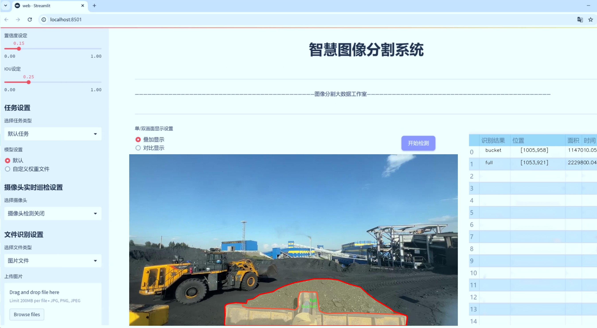
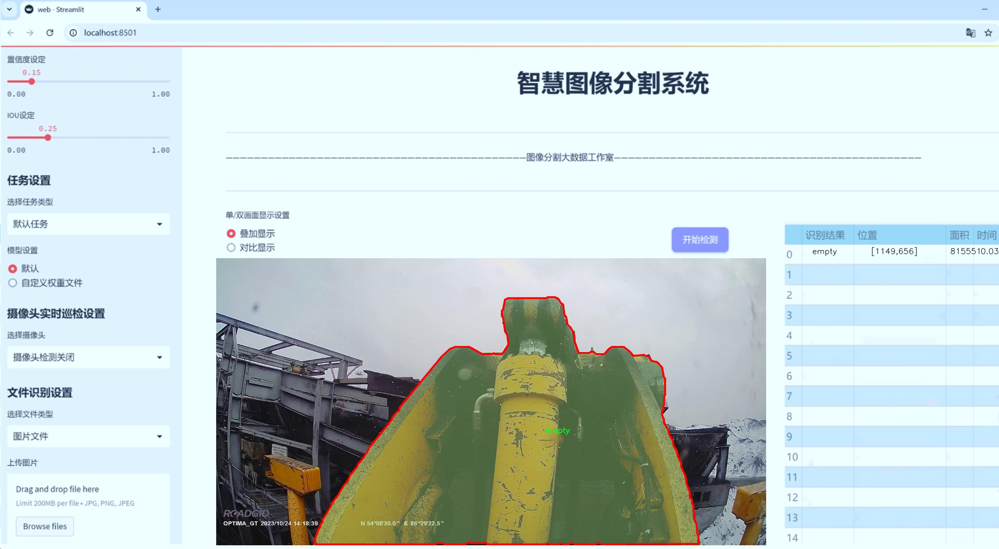
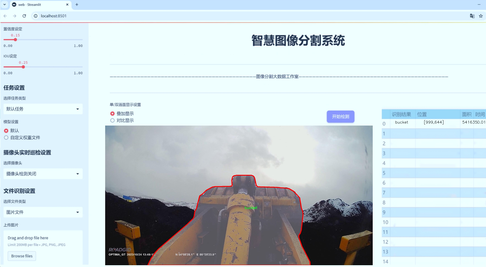
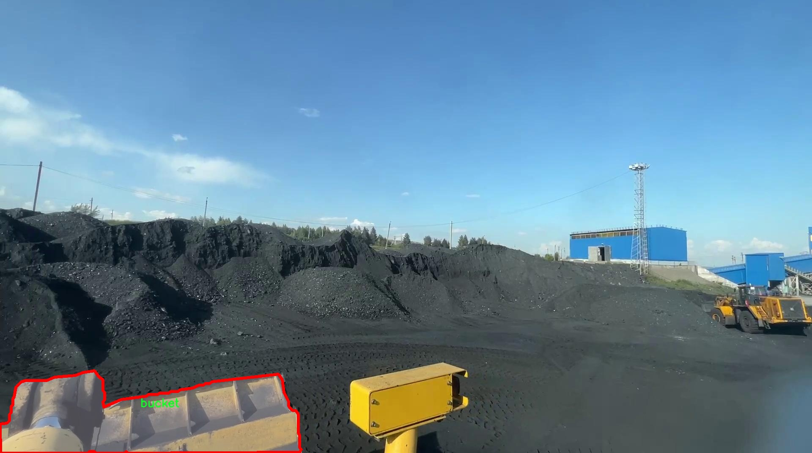
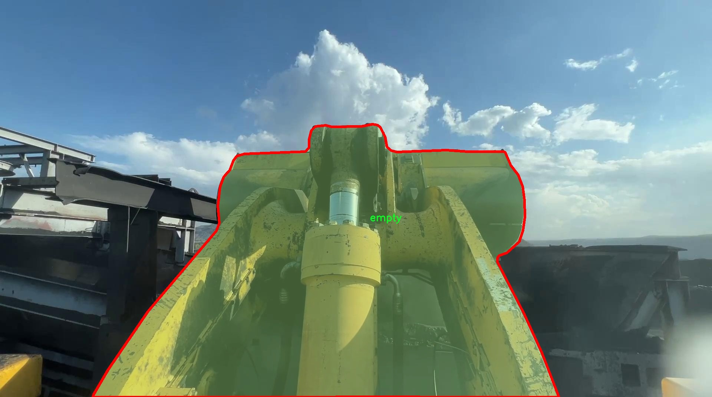
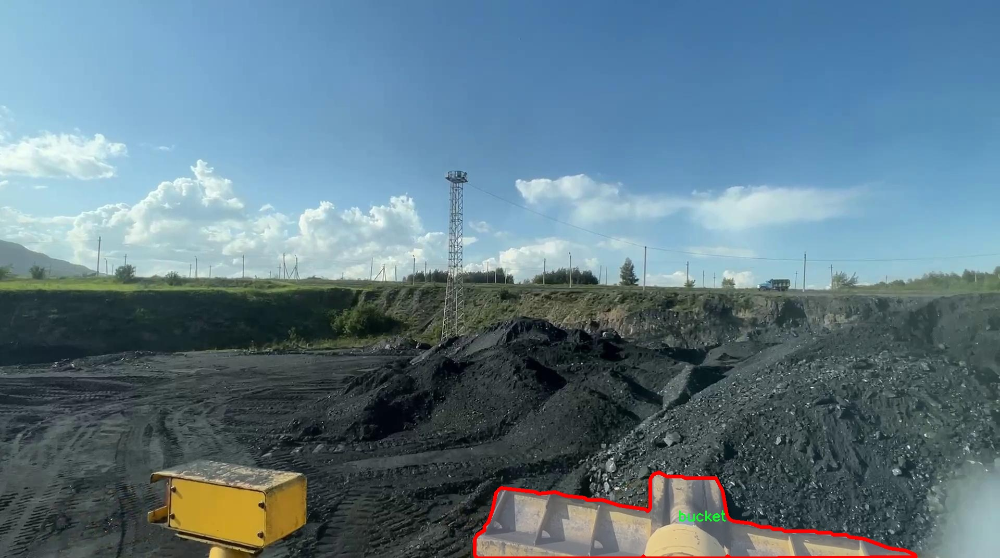
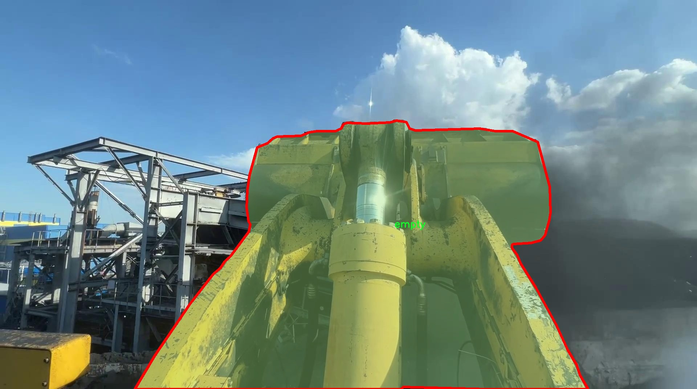
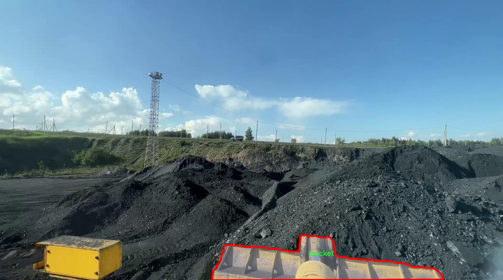

# 挖掘机铲斗状态分割系统： yolov8-seg-C2f-RFAConv

### 1.研究背景与意义

[参考博客](https://gitee.com/YOLOv8_YOLOv11_Segmentation_Studio/projects)

[博客来源](https://kdocs.cn/l/cszuIiCKVNis)

研究背景与意义

随着工程机械行业的快速发展，挖掘机作为一种重要的土方作业设备，其工作效率和安全性直接影响到工程进度和施工质量。在挖掘机的作业过程中，铲斗的状态（如是否满载、是否空载）对于作业效率的优化具有重要意义。因此，实时监测和识别挖掘机铲斗的状态，不仅能够提高施工效率，还能降低资源浪费和事故风险。然而，传统的状态监测方法往往依赖于人工观察和经验判断，存在主观性强、效率低下等问题，亟需引入先进的计算机视觉技术进行改进。

近年来，深度学习技术的迅猛发展为目标检测和图像分割领域带来了新的机遇。YOLO（You Only Look Once）系列模型因其高效的实时检测能力和良好的准确性，逐渐成为计算机视觉领域的研究热点。特别是YOLOv8模型，其在精度和速度上的显著提升，使其在复杂场景下的应用潜力更为广泛。基于YOLOv8的挖掘机铲斗状态分割系统的研究，旨在利用深度学习技术对铲斗的状态进行精准识别与分割，为挖掘机的智能化作业提供支持。

本研究所使用的数据集包含1200张图像，涵盖了三种类别：铲斗（bucket）、空载（empty）和满载（full）。这些数据不仅为模型的训练提供了丰富的样本，也为模型的评估和优化奠定了基础。通过对这些图像的分析与处理，研究者能够提取出铲斗状态的特征信息，从而提高模型的分割精度和识别率。此外，数据集的多样性和丰富性使得模型在不同环境和条件下的适应性得以增强，进一步提升了系统的实用性。

本研究的意义在于，通过改进YOLOv8模型，构建一个高效的挖掘机铲斗状态分割系统，不仅能够实现对铲斗状态的实时监测，还能为挖掘机的智能化管理提供数据支持。这一系统的应用将有助于实现施工现场的智能化监控，提高工程机械的作业效率，降低人工成本，并减少因人为因素导致的操作失误。同时，研究成果还可以为其他工程机械的状态监测提供借鉴，推动整个工程机械行业的智能化发展。

综上所述，基于改进YOLOv8的挖掘机铲斗状态分割系统的研究，不仅具有重要的理论价值，也具备广泛的实际应用前景。通过深入探讨铲斗状态的自动识别与分割技术，能够为工程机械的智能化转型提供有力的技术支撑，促进工程施工的安全、高效与可持续发展。

### 2.图片演示







注意：本项目提供完整的训练源码数据集和训练教程,由于此博客编辑较早,暂不提供权重文件（best.pt）,需要按照6.训练教程进行训练后实现上图效果。

### 3.视频演示

[3.1 视频演示](https://www.bilibili.com/video/BV1fczgY8EsQ/)

### 4.数据集信息

##### 4.1 数据集类别数＆类别名

nc: 3
names: ['bucket', 'empty', 'full']


##### 4.2 数据集信息简介

数据集信息展示

在现代工程和建筑领域，挖掘机作为一种重要的机械设备，其铲斗的状态直接影响到施工效率和安全性。因此，开发一个高效的铲斗状态分割系统显得尤为重要。本研究旨在利用改进的YOLOv8-seg模型，针对挖掘机铲斗的不同状态进行精确的分割和识别。为此，我们构建了一个专门的数据集，命名为“excavator bucket”，该数据集为模型的训练和评估提供了坚实的基础。

“excavator bucket”数据集包含三种主要类别，分别是“bucket”、“empty”和“full”。每个类别代表了铲斗在不同工作状态下的特征和表现。“bucket”类别主要指的是铲斗的基本形态，无论是空铲斗还是装载状态下的铲斗，都归入这一类别。这个类别的样本对于模型学习铲斗的轮廓和结构至关重要。其次，“empty”类别则专注于铲斗处于空载状态时的特征，通常表现为铲斗内部没有任何物料，模型需要识别出这一状态以便在实际操作中进行有效的监控和管理。最后，“full”类别则对应于铲斗装载满物料的状态，这一类别的样本不仅包括不同类型的物料，还涵盖了铲斗在满载时的各种姿态和角度。

为了确保数据集的多样性和代表性，我们在不同的工作环境和条件下收集了大量的图像数据。这些图像涵盖了各种天气、光照和背景条件，确保模型在训练过程中能够学习到丰富的特征信息。此外，数据集中的每个类别都经过精心标注，确保每个图像的铲斗状态能够被准确识别和分类。这种精确的标注不仅提高了模型的训练效率，也为后续的评估和验证提供了可靠的依据。

在数据集的构建过程中，我们还考虑到了数据的平衡性。为了避免模型在训练过程中出现偏差，我们确保每个类别的样本数量相对均衡。这种平衡的样本分布使得模型能够在不同状态下进行有效的学习，从而提高了其在实际应用中的泛化能力。

总之，“excavator bucket”数据集为改进YOLOv8-seg的挖掘机铲斗状态分割系统提供了重要的支持。通过对不同状态的铲斗进行精确的分类和分割，模型将能够在实际应用中实现更高的准确性和效率。这一数据集不仅为本研究提供了坚实的基础，也为未来在挖掘机及其他重型机械设备的智能监控和管理领域的研究奠定了良好的基础。随着技术的不断进步，我们期待这一系统能够在实际操作中发挥重要作用，为工程建设的安全和效率提供保障。











### 5.项目依赖环境部署教程（零基础手把手教学）

[5.1 环境部署教程链接（零基础手把手教学）](https://www.bilibili.com/video/BV1jG4Ve4E9t/?vd_source=bc9aec86d164b67a7004b996143742dc)


[5.2 安装Python虚拟环境创建和依赖库安装视频教程链接（零基础手把手教学）](https://www.bilibili.com/video/BV1nA4VeYEze/?vd_source=bc9aec86d164b67a7004b996143742dc)

### 6.手把手YOLOV8-seg训练视频教程（零基础手把手教学）

[6.1 手把手YOLOV8-seg训练视频教程（零基础小白有手就能学会）](https://www.bilibili.com/video/BV1cA4VeYETe/?vd_source=bc9aec86d164b67a7004b996143742dc)


按照上面的训练视频教程链接加载项目提供的数据集，运行train.py即可开始训练



     Epoch   gpu_mem       box       obj       cls    labels  img_size
     1/200     0G   0.01576   0.01955  0.007536        22      1280: 100%|██████████| 849/849 [14:42<00:00,  1.04s/it]
               Class     Images     Labels          P          R     mAP@.5 mAP@.5:.95: 100%|██████████| 213/213 [01:14<00:00,  2.87it/s]
                 all       3395      17314      0.994      0.957      0.0957      0.0843

     Epoch   gpu_mem       box       obj       cls    labels  img_size
     2/200     0G   0.01578   0.01923  0.007006        22      1280: 100%|██████████| 849/849 [14:44<00:00,  1.04s/it]
               Class     Images     Labels          P          R     mAP@.5 mAP@.5:.95: 100%|██████████| 213/213 [01:12<00:00,  2.95it/s]
                 all       3395      17314      0.996      0.956      0.0957      0.0845

     Epoch   gpu_mem       box       obj       cls    labels  img_size
     3/200     0G   0.01561    0.0191  0.006895        27      1280: 100%|██████████| 849/849 [10:56<00:00,  1.29it/s]
               Class     Images     Labels          P          R     mAP@.5 mAP@.5:.95: 100%|███████   | 187/213 [00:52<00:00,  4.04it/s]
                 all       3395      17314      0.996      0.957      0.0957      0.0845


### 7.50+种全套YOLOV8-seg创新点加载调参实验视频教程（一键加载写好的改进模型的配置文件）

[7.1 50+种全套YOLOV8-seg创新点加载调参实验视频教程（一键加载写好的改进模型的配置文件）](https://www.bilibili.com/video/BV1Hw4VePEXv/?vd_source=bc9aec86d164b67a7004b996143742dc)

### YOLOV8-seg算法简介

原始YOLOv8-seg算法原理

YOLOv8-seg算法是Ultralytics公司在2023年推出的YOLO系列中的最新版本，代表了目标检测和图像分割领域的重大进步。相较于前代版本，YOLOv8-seg不仅在检测精度和速度上取得了显著提升，还在模型结构和算法设计上进行了创新，特别是在处理复杂场景和多样化目标时展现出更强的适应性。

YOLOv8-seg的核心思想是通过引入新的网络结构和模块来优化特征提取和目标检测过程。其网络结构分为输入端、骨干网络、颈部网络和头部网络四个主要部分。输入端负责数据预处理，包括马赛克增强和自适应锚框计算，以提高模型对不同尺寸和比例图像的适应能力。马赛克增强技术通过将多张图像随机拼接成一张新图像，迫使模型学习到更丰富的特征和背景信息，从而提升模型的泛化能力。

在骨干网络部分，YOLOv8-seg采用了C2f模块替代了YOLOv5中的C3模块。C2f模块的设计灵感来源于YOLOv7的ELAN结构，通过并行多个梯度流分支，增强了模型的特征表示能力。这种结构的优势在于能够更有效地捕捉不同尺度的特征信息，从而提高模型在复杂场景下的检测精度。与传统的卷积层相比，C2f模块在保持轻量化的同时，能够获得更丰富的梯度流信息，使得模型在训练过程中更为高效。

颈部网络采用了路径聚合网络（PAN）结构，这一设计旨在加强不同尺度特征的融合能力。PAN通过对特征图进行多层次的聚合，能够有效地结合来自骨干网络的不同层次特征，确保模型在处理小目标和大目标时都能保持较高的检测精度。这种特征融合策略使得YOLOv8-seg在面对复杂背景和遮挡物体时，依然能够保持良好的检测性能。

头部网络是YOLOv8-seg中变化最大的部分。传统的耦合头结构被解耦头结构所取代，这一改进使得分类和检测过程能够独立进行，从而提高了模型的灵活性和效率。在解耦头结构中，输入特征图首先通过两个1x1卷积模块进行降维，然后分别进行类别预测和边界框位置预测。这种设计不仅提高了模型的计算效率，还减少了训练过程中的逻辑不一致性。

YOLOv8-seg还引入了Anchor-Free的检测方式，摒弃了传统的基于锚框的检测方法。Anchor-Free方法将目标检测转化为关键点检测，不再依赖于预设的锚框，从而简化了模型结构，提升了泛化能力。这一策略的优势在于能够更灵活地适应不同数据集和目标物体的特征，避免了锚框数量和尺寸选择的不确定性。此外，Anchor-Free方法还减少了在训练和推理过程中对IoU计算的需求，从而加快了模型的推理速度。

在损失函数的设计上，YOLOv8-seg采用了Task-Aligned Assigner策略，根据分类与回归的分数加权结果选择正样本。损失计算过程涵盖了分类和回归两个分支，其中分类分支使用二元交叉熵损失（BCELoss），而回归分支则结合了分布焦点损失（DFLoss）和完全交并比损失（CIOULoss）。这种损失函数的设计旨在提高模型对边界框预测的精准性，使得模型在面对复杂场景时，能够更快速地聚焦于目标区域。

总的来说，YOLOv8-seg算法通过引入新的网络结构、优化特征提取和目标检测过程，显著提升了目标检测和图像分割的性能。其创新的解耦头结构和Anchor-Free检测方式，不仅提高了模型的灵活性和效率，还增强了其在多样化场景下的适应能力。这些改进使得YOLOv8-seg成为目标检测和图像分割任务中的一个强大工具，适用于各种实际应用场景。随着YOLOv8-seg的不断发展和完善，未来在智能监控、自动驾驶、医疗影像分析等领域的应用前景将更加广阔。


### 9.系统功能展示（检测对象为举例，实际内容以本项目数据集为准）

图9.1.系统支持检测结果表格显示

  图9.2.系统支持置信度和IOU阈值手动调节

  图9.3.系统支持自定义加载权重文件best.pt(需要你通过步骤5中训练获得)

  图9.4.系统支持摄像头实时识别

  图9.5.系统支持图片识别

  图9.6.系统支持视频识别

  图9.7.系统支持识别结果文件自动保存

  图9.8.系统支持Excel导出检测结果数据


### 10.50+种全套YOLOV8-seg创新点原理讲解（非科班也可以轻松写刊发刊，V11版本正在科研待更新）

#### 10.1 由于篇幅限制，每个创新点的具体原理讲解就不一一展开，具体见下列网址中的创新点对应子项目的技术原理博客网址【Blog】：


[10.1 50+种全套YOLOV8-seg创新点原理讲解链接](https://gitee.com/qunmasj/good)

#### 10.2 部分改进模块原理讲解(完整的改进原理见上图和技术博客链接)【如果此小节的图加载失败可以通过CSDN或者Github搜索该博客的标题访问原始博客，原始博客图片显示正常】

### YOLOv8简介
#### Backbone
Darknet-53
53指的是“52层卷积”+output layer。

借鉴了其他算法的这些设计思想

借鉴了VGG的思想，使用了较多的3×3卷积，在每一次池化操作后，将通道数翻倍；

借鉴了network in network的思想，使用全局平均池化（global average pooling）做预测，并把1×1的卷积核置于3×3的卷积核之间，用来压缩特征；（我没找到这一步体现在哪里）


使用了批归一化层稳定模型训练，加速收敛，并且起到正则化作用。

    以上三点为Darknet19借鉴其他模型的点。Darknet53当然是在继承了Darknet19的这些优点的基础上再新增了下面这些优点的。因此列在了这里

借鉴了ResNet的思想，在网络中大量使用了残差连接，因此网络结构可以设计的很深，并且缓解了训练中梯度消失的问题，使得模型更容易收敛。

使用步长为2的卷积层代替池化层实现降采样。（这一点在经典的Darknet-53上是很明显的，output的长和宽从256降到128，再降低到64，一路降低到8，应该是通过步长为2的卷积层实现的；在YOLOv8的卷积层中也有体现，比如图中我标出的这些位置）

#### 特征融合

模型架构图如下

  Darknet-53的特点可以这样概括：（Conv卷积模块+Residual Block残差块）串行叠加4次

  Conv卷积层+Residual Block残差网络就被称为一个stage


上面红色指出的那个，原始的Darknet-53里面有一层 卷积，在YOLOv8里面，把一层卷积移除了

为什么移除呢？

        原始Darknet-53模型中间加的这个卷积层做了什么？滤波器（卷积核）的个数从 上一个卷积层的512个，先增加到1024个卷积核，然后下一层卷积的卷积核的个数又降低到512个

        移除掉这一层以后，少了1024个卷积核，就可以少做1024次卷积运算，同时也少了1024个3×3的卷积核的参数，也就是少了9×1024个参数需要拟合。这样可以大大减少了模型的参数，（相当于做了轻量化吧）

        移除掉这个卷积层，可能是因为作者发现移除掉这个卷积层以后，模型的score有所提升，所以才移除掉的。为什么移除掉以后，分数有所提高呢？可能是因为多了这些参数就容易，参数过多导致模型在训练集删过拟合，但是在测试集上表现很差，最终模型的分数比较低。你移除掉这个卷积层以后，参数减少了，过拟合现象不那么严重了，泛化能力增强了。当然这个是，拿着你做实验的结论，反过来再找补，再去强行解释这种现象的合理性。


通过MMdetection官方绘制册这个图我们可以看到，进来的这张图片经过一个“Feature Pyramid Network(简称FPN)”，然后最后的P3、P4、P5传递给下一层的Neck和Head去做识别任务。 PAN（Path Aggregation Network）


“FPN是自顶向下，将高层的强语义特征传递下来。PAN就是在FPN的后面添加一个自底向上的金字塔，对FPN补充，将低层的强定位特征传递上去，

FPN是自顶（小尺寸，卷积次数多得到的结果，语义信息丰富）向下（大尺寸，卷积次数少得到的结果），将高层的强语义特征传递下来，对整个金字塔进行增强，不过只增强了语义信息，对定位信息没有传递。PAN就是针对这一点，在FPN的后面添加一个自底（卷积次数少，大尺寸）向上（卷积次数多，小尺寸，语义信息丰富）的金字塔，对FPN补充，将低层的强定位特征传递上去，又被称之为“双塔战术”。

FPN层自顶向下传达强语义特征，而特征金字塔则自底向上传达强定位特征，两两联手，从不同的主干层对不同的检测层进行参数聚合,这样的操作确实很皮。
#### 自底向上增强


而 PAN（Path Aggregation Network）是对 FPN 的一种改进，它的设计理念是在 FPN 后面添加一个自底向上的金字塔。PAN 引入了路径聚合的方式，通过将浅层特征图（低分辨率但语义信息较弱）和深层特征图（高分辨率但语义信息丰富）进行聚合，并沿着特定的路径传递特征信息，将低层的强定位特征传递上去。这样的操作能够进一步增强多尺度特征的表达能力，使得 PAN 在目标检测任务中表现更加优秀。


### Gold-YOLO简介
YOLO系列模型面世至今已有8年，由于其优异的性能，已成为目标检测领域的标杆。在系列模型经过十多个不同版本的改进发展逐渐稳定完善的今天，研究人员更多关注于单个计算模块内结构的精细调整，或是head部分和训练方法上的改进。但这并不意味着现有模式已是最优解。

当前YOLO系列模型通常采用类FPN方法进行信息融合，而这一结构在融合跨层信息时存在信息损失的问题。针对这一问题，我们提出了全新的信息聚集-分发（Gather-and-Distribute Mechanism）GD机制，通过在全局视野上对不同层级的特征进行统一的聚集融合并分发注入到不同层级中，构建更加充分高效的信息交互融合机制，并基于GD机制构建了Gold-YOLO。在COCO数据集中，我们的Gold-YOLO超越了现有的YOLO系列，实现了精度-速度曲线上的SOTA。


精度和速度曲线（TensorRT7）


精度和速度曲线（TensorRT8）
传统YOLO的问题
在检测模型中，通常先经过backbone提取得到一系列不同层级的特征，FPN利用了backbone的这一特点，构建了相应的融合结构：不层级的特征包含着不同大小物体的位置信息，虽然这些特征包含的信息不同，但这些特征在相互融合后能够互相弥补彼此缺失的信息，增强每一层级信息的丰富程度，提升网络性能。

原始的FPN结构由于其层层递进的信息融合模式，使得相邻层的信息能够充分融合，但也导致了跨层信息融合存在问题：当跨层的信息进行交互融合时，由于没有直连的交互通路，只能依靠中间层充当“中介”进行融合，导致了一定的信息损失。之前的许多工作中都关注到了这一问题，而解决方案通常是通过添加shortcut增加更多的路径，以增强信息流动。

然而传统的FPN结构即便改进后，由于网络中路径过多，且交互方式不直接，基于FPN思想的信息融合结构仍然存在跨层信息交互困难和信息损失的问题。

#### Gold-YOLO：全新的信息融合交互机制


#### Gold-YOLO架构
参考该博客提出的一种全新的信息交互融合机制：信息聚集-分发机制(Gather-and-Distribute Mechanism)。该机制通过在全局上融合不同层次的特征得到全局信息，并将全局信息注入到不同层级的特征中，实现了高效的信息交互和融合。在不显著增加延迟的情况下GD机制显著增强了Neck部分的信息融合能力，提高了模型对不同大小物体的检测能力。

GD机制通过三个模块实现：信息对齐模块(FAM)、信息融合模块(IFM)和信息注入模块(Inject)。

信息对齐模块负责收集并对齐不同层级不同大小的特征

信息融合模块通过使用卷积或Transformer算子对对齐后的的特征进行融合，得到全局信息

信息注入模块将全局信息注入到不同层级中

在Gold-YOLO中，针对模型需要检测不同大小的物体的需要，并权衡精度和速度，我们构建了两个GD分支对信息进行融合：低层级信息聚集-分发分支(Low-GD)和高层级信息聚集-分发分支(High-GD)，分别基于卷积和transformer提取和融合特征信息。

此外,为了促进局部信息的流动，我们借鉴现有工作，构建了一个轻量级的邻接层融合模块，该模块在局部尺度上结合了邻近层的特征，进一步提升了模型性能。我们还引入并验证了预训练方法对YOLO模型的有效性，通过在ImageNet 1K上使用MAE方法对主干进行预训练，显著提高了模型的收敛速度和精度。


### 11.项目核心源码讲解（再也不用担心看不懂代码逻辑）

#### 11.1 ultralytics\data\converter.py

以下是经过简化和注释的核心代码部分，主要包括 COCO 数据集的转换函数和 DOTA 数据集的转换函数。代码中保留了最重要的逻辑，并添加了详细的中文注释。

```python
import json
from collections import defaultdict
from pathlib import Path
import numpy as np
from ultralytics.utils import LOGGER, TQDM
from ultralytics.utils.files import increment_path

def coco91_to_coco80_class():
    """
    将 COCO 数据集的 91 类别 ID 转换为 80 类别 ID。
    
    Returns:
        (list): 91 类别 ID 列表，其中索引表示 80 类别 ID，值为对应的 91 类别 ID。
    """
    return [
        0, 1, 2, 3, 4, 5, 6, 7, 8, 9, 10, None, 11, 12, 13, 14, 15, 16, 17, 18, 19, 20, 21, 22, 23, None, 24, 25, None,
        None, 26, 27, 28, 29, 30, 31, 32, 33, 34, 35, 36, 37, 38, 39, None, 40, 41, 42, 43, 44, 45, 46, 47, 48, 49, 50,
        51, 52, 53, 54, 55, 56, 57, 58, 59, None, 60, None, None, 61, None, 62, 63, 64, 65, 66, 67, 68, 69, 70, 71, 72,
        None, 73, 74, 75, 76, 77, 78, 79, None]

def convert_coco(labels_dir='../coco/annotations/',
                 save_dir='coco_converted/',
                 use_segments=False,
                 use_keypoints=False,
                 cls91to80=True):
    """
    将 COCO 数据集的注释转换为 YOLO 格式的注释，以便训练 YOLO 模型。

    Args:
        labels_dir (str): COCO 数据集注释文件的目录路径。
        save_dir (str): 保存转换结果的目录路径。
        use_segments (bool): 是否在输出中包含分割掩码。
        use_keypoints (bool): 是否在输出中包含关键点注释。
        cls91to80 (bool): 是否将 91 类别 ID 映射到对应的 80 类别 ID。
    """
    # 创建保存目录
    save_dir = increment_path(save_dir)  # 如果保存目录已存在，则递增
    for p in save_dir / 'labels', save_dir / 'images':
        p.mkdir(parents=True, exist_ok=True)  # 创建目录

    # 转换类别
    coco80 = coco91_to_coco80_class()

    # 导入 JSON 文件
    for json_file in sorted(Path(labels_dir).resolve().glob('*.json')):
        fn = Path(save_dir) / 'labels' / json_file.stem.replace('instances_', '')  # 文件夹名称
        fn.mkdir(parents=True, exist_ok=True)
        with open(json_file) as f:
            data = json.load(f)

        # 创建图像字典
        images = {f'{x["id"]:d}': x for x in data['images']}
        # 创建图像-注释字典
        imgToAnns = defaultdict(list)
        for ann in data['annotations']:
            imgToAnns[ann['image_id']].append(ann)

        # 写入标签文件
        for img_id, anns in TQDM(imgToAnns.items(), desc=f'Annotations {json_file}'):
            img = images[f'{img_id:d}']
            h, w, f = img['height'], img['width'], img['file_name']

            bboxes = []  # 存储边界框
            for ann in anns:
                if ann['iscrowd']:
                    continue  # 跳过人群注释
                # COCO 边界框格式为 [左上角 x, 左上角 y, 宽度, 高度]
                box = np.array(ann['bbox'], dtype=np.float64)
                box[:2] += box[2:] / 2  # 将左上角坐标转换为中心坐标
                box[[0, 2]] /= w  # 归一化 x
                box[[1, 3]] /= h  # 归一化 y
                if box[2] <= 0 or box[3] <= 0:  # 如果宽度或高度小于等于 0
                    continue

                cls = coco80[ann['category_id'] - 1] if cls91to80 else ann['category_id'] - 1  # 类别
                box = [cls] + box.tolist()  # 将类别和边界框合并
                if box not in bboxes:
                    bboxes.append(box)

            # 写入文件
            with open((fn / f).with_suffix('.txt'), 'a') as file:
                for bbox in bboxes:
                    file.write(('%g ' * len(bbox)).rstrip() % bbox + '\n')

    LOGGER.info(f'COCO 数据成功转换。\n结果保存到 {save_dir.resolve()}')

def convert_dota_to_yolo_obb(dota_root_path: str):
    """
    将 DOTA 数据集的注释转换为 YOLO OBB（定向边界框）格式。

    Args:
        dota_root_path (str): DOTA 数据集的根目录路径。
    """
    dota_root_path = Path(dota_root_path)

    # 类别名称到索引的映射
    class_mapping = {
        'plane': 0,
        'ship': 1,
        'storage-tank': 2,
        'baseball-diamond': 3,
        'tennis-court': 4,
        'basketball-court': 5,
        'ground-track-field': 6,
        'harbor': 7,
        'bridge': 8,
        'large-vehicle': 9,
        'small-vehicle': 10,
        'helicopter': 11,
        'roundabout': 12,
        'soccer ball-field': 13,
        'swimming-pool': 14,
        'container-crane': 15,
        'airport': 16,
        'helipad': 17}

    def convert_label(image_name, image_width, image_height, orig_label_dir, save_dir):
        """将单个图像的 DOTA 注释转换为 YOLO OBB 格式并保存到指定目录。"""
        orig_label_path = orig_label_dir / f'{image_name}.txt'
        save_path = save_dir / f'{image_name}.txt'

        with orig_label_path.open('r') as f, save_path.open('w') as g:
            lines = f.readlines()
            for line in lines:
                parts = line.strip().split()
                if len(parts) < 9:
                    continue  # 跳过无效行
                class_name = parts[8]
                class_idx = class_mapping[class_name]  # 获取类别索引
                coords = [float(p) for p in parts[:8]]  # 获取坐标
                # 归一化坐标
                normalized_coords = [
                    coords[i] / image_width if i % 2 == 0 else coords[i] / image_height for i in range(8)]
                formatted_coords = ['{:.6g}'.format(coord) for coord in normalized_coords]
                g.write(f"{class_idx} {' '.join(formatted_coords)}\n")  # 写入转换后的数据

    for phase in ['train', 'val']:
        image_dir = dota_root_path / 'images' / phase
        orig_label_dir = dota_root_path / 'labels' / f'{phase}_original'
        save_dir = dota_root_path / 'labels' / phase

        save_dir.mkdir(parents=True, exist_ok=True)

        image_paths = list(image_dir.iterdir())
        for image_path in TQDM(image_paths, desc=f'Processing {phase} images'):
            if image_path.suffix != '.png':
                continue  # 只处理 PNG 格式的图像
            image_name_without_ext = image_path.stem
            img = cv2.imread(str(image_path))
            h, w = img.shape[:2]
            convert_label(image_name_without_ext, w, h, orig_label_dir, save_dir)  # 转换标签并保存
```

### 主要功能
1. **COCO 数据集转换**：将 COCO 数据集的注释转换为 YOLO 格式，包括类别 ID 的转换和边界框的归一化。
2. **DOTA 数据集转换**：将 DOTA 数据集的注释转换为 YOLO OBB 格式，支持类别名称到索引的映射和坐标的归一化。

### 注释说明
- 每个函数的功能、参数和返回值都进行了详细注释。
- 关键步骤和逻辑也进行了说明，以便于理解代码的实现过程。

这个文件是一个用于将COCO数据集的标注转换为YOLO格式的Python脚本，主要包含了几个功能函数和一个主转换函数。首先，文件导入了一些必要的库，包括`json`、`collections`、`pathlib`、`cv2`和`numpy`，以及一些来自`ultralytics`的工具函数和日志记录器。

文件中定义了两个函数`coco91_to_coco80_class`和`coco80_to_coco91_class`，它们分别用于将COCO数据集中91个类别的ID转换为80个类别的ID，反之亦然。这是因为COCO数据集的标注在不同的上下文中可能会使用不同的类别ID。

接下来是`convert_coco`函数，这是文件的核心功能。它的作用是将COCO数据集的标注文件转换为YOLO所需的格式。函数接受多个参数，包括标注文件的目录、保存结果的目录、是否使用分割掩码和关键点标注，以及是否将91个类别ID映射到80个类别ID。函数首先创建保存结果的目录，然后读取指定目录下的所有JSON标注文件。

在处理每个JSON文件时，函数会构建一个图像字典和一个图像-标注字典。接着，它会遍历每个图像的标注，提取边界框、分割和关键点信息，并将其转换为YOLO格式。边界框的格式会从COCO的格式（左上角坐标和宽高）转换为YOLO的格式（中心坐标和宽高），并进行归一化处理。最后，函数将转换后的标注写入到指定的文本文件中。

此外，文件还定义了一个`convert_dota_to_yolo_obb`函数，用于将DOTA数据集的标注转换为YOLO的有向边界框格式。该函数会遍历DOTA数据集中的训练和验证图像，读取原始标注并进行转换，最终将结果保存到新的目录中。

文件中还包含了两个辅助函数`min_index`和`merge_multi_segment`。`min_index`用于查找两个二维点数组之间距离最短的点对索引，而`merge_multi_segment`则用于合并多个分割线段，将它们连接成一个连续的线段。

总的来说，这个文件提供了从COCO和DOTA数据集到YOLO格式的标注转换功能，方便用户在训练YOLO模型时使用这些数据集的标注。

#### 11.2 train.py

以下是代码中最核心的部分，并附上详细的中文注释：

```python
import os
import torch
import yaml
from ultralytics import YOLO  # 导入YOLO模型

if __name__ == '__main__':  # 确保该模块被直接运行时才执行以下代码
    # 设置训练参数
    workers = 1  # 数据加载的工作进程数
    batch = 8  # 每个批次的大小，适当调整以适应显存/内存
    device = "0" if torch.cuda.is_available() else "cpu"  # 检查是否有可用的GPU

    # 获取数据集配置文件的绝对路径
    data_path = abs_path(f'datasets/data/data.yaml', path_type='current')

    # 将路径格式转换为Unix风格
    unix_style_path = data_path.replace(os.sep, '/')
    # 获取目录路径
    directory_path = os.path.dirname(unix_style_path)

    # 读取YAML文件，保持原有顺序
    with open(data_path, 'r') as file:
        data = yaml.load(file, Loader=yaml.FullLoader)

    # 修改数据集路径
    if 'train' in data and 'val' in data and 'test' in data:
        data['train'] = directory_path + '/train'  # 设置训练集路径
        data['val'] = directory_path + '/val'      # 设置验证集路径
        data['test'] = directory_path + '/test'    # 设置测试集路径

        # 将修改后的数据写回YAML文件
        with open(data_path, 'w') as file:
            yaml.safe_dump(data, file, sort_keys=False)

    # 加载YOLO模型配置和预训练权重
    model = YOLO(r"C:\codeseg\codenew\50+种YOLOv8算法改进源码大全和调试加载训练教程（非必要）\改进YOLOv8模型配置文件\yolov8-seg-C2f-Faster.yaml").load("./weights/yolov8s-seg.pt")

    # 开始训练模型
    results = model.train(
        data=data_path,  # 指定训练数据的配置文件路径
        device=device,  # 使用指定的设备进行训练
        workers=workers,  # 使用的工作进程数
        imgsz=640,  # 输入图像的大小为640x640
        epochs=100,  # 训练100个epoch
        batch=batch,  # 每个批次的大小
    )
```

### 代码核心部分说明：
1. **导入必要的库**：导入了操作系统、PyTorch、YAML解析库和YOLO模型。
2. **设置训练参数**：包括工作进程数、批次大小和设备选择（GPU或CPU）。
3. **数据集路径处理**：获取数据集配置文件的绝对路径，并将路径格式转换为Unix风格。
4. **读取和修改YAML文件**：读取数据集配置文件，修改训练、验证和测试集的路径，并将修改后的内容写回文件。
5. **加载YOLO模型**：根据指定的配置文件和预训练权重加载YOLO模型。
6. **训练模型**：调用模型的训练方法，传入必要的参数，如数据路径、设备、工作进程数、图像大小、训练轮数和批次大小。

这个程序文件 `train.py` 是用于训练 YOLO（You Only Look Once）模型的脚本，主要依赖于 PyTorch 和 Ultraytics YOLO 库。程序的主要功能是加载数据集、配置模型并开始训练。

首先，程序导入了必要的库，包括 `os`、`torch`、`yaml` 和 `matplotlib`。其中，`torch` 是 PyTorch 的核心库，`yaml` 用于处理 YAML 格式的配置文件，`matplotlib` 用于绘图（在这里设置为 `TkAgg` 后端）。

在 `if __name__ == '__main__':` 这一块，程序首先设置了一些训练参数。`workers` 被设置为 1，表示数据加载时使用的工作进程数量。`batch` 设置为 8，表示每个训练批次的样本数量，这个值可以根据显存和内存的情况进行调整。接着，程序检查是否有可用的 GPU，如果有，则将 `device` 设置为 "0"（表示使用第一个 GPU），否则使用 CPU。

接下来，程序通过 `abs_path` 函数获取数据集配置文件 `data.yaml` 的绝对路径，并将路径中的分隔符统一为 Unix 风格。然后，程序提取出该路径的目录部分，以便后续修改数据集路径。

程序打开 `data.yaml` 文件并读取其内容，使用 `yaml.load` 方法保持原有顺序。之后，程序检查 YAML 文件中是否包含 `train`、`val` 和 `test` 字段，如果有，则将这些字段的值修改为对应的训练、验证和测试数据集的路径。修改完成后，程序将更新后的数据写回到 YAML 文件中。

接下来，程序加载 YOLO 模型。这里使用的是一个特定的配置文件 `yolov8-seg-C2f-Faster.yaml`，并加载预训练的权重文件 `yolov8s-seg.pt`。需要注意的是，不同的模型对设备的要求不同，如果遇到内存不足的错误，可以尝试使用其他模型配置文件。

最后，程序调用 `model.train` 方法开始训练模型。训练时指定了数据配置文件的路径、设备、工作进程数量、输入图像的大小（640x640）、训练的 epoch 数量（100）以及每个批次的大小（8）。通过这些参数，程序能够有效地进行模型训练。

总的来说，这个脚本提供了一个相对完整的 YOLO 模型训练流程，包括数据准备、模型加载和训练参数设置。

#### 11.3 ultralytics\engine\results.py

以下是代码中最核心的部分，并附上详细的中文注释：

```python
class BaseTensor(SimpleClass):
    """基础张量类，提供额外的方法以便于操作和设备管理。"""

    def __init__(self, data, orig_shape) -> None:
        """
        初始化 BaseTensor，包含数据和原始形状。

        参数:
            data (torch.Tensor | np.ndarray): 预测结果，例如边界框、掩码和关键点。
            orig_shape (tuple): 图像的原始形状。
        """
        assert isinstance(data, (torch.Tensor, np.ndarray))  # 确保数据是张量或数组
        self.data = data  # 存储数据
        self.orig_shape = orig_shape  # 存储原始形状

    @property
    def shape(self):
        """返回数据张量的形状。"""
        return self.data.shape

    def cpu(self):
        """返回在CPU内存上的张量副本。"""
        return self if isinstance(self.data, np.ndarray) else self.__class__(self.data.cpu(), self.orig_shape)

    def numpy(self):
        """返回张量的numpy数组副本。"""
        return self if isinstance(self.data, np.ndarray) else self.__class__(self.data.numpy(), self.orig_shape)

    def cuda(self):
        """返回在GPU内存上的张量副本。"""
        return self.__class__(torch.as_tensor(self.data).cuda(), self.orig_shape)

    def to(self, *args, **kwargs):
        """返回具有指定设备和数据类型的张量副本。"""
        return self.__class__(torch.as_tensor(self.data).to(*args, **kwargs), self.orig_shape)

    def __len__(self):  # 重写len(results)
        """返回数据张量的长度。"""
        return len(self.data)

    def __getitem__(self, idx):
        """返回指定索引的 BaseTensor。"""
        return self.__class__(self.data[idx], self.orig_shape)


class Results(SimpleClass):
    """
    存储和操作推理结果的类。

    参数:
        orig_img (numpy.ndarray): 原始图像的numpy数组。
        path (str): 图像文件的路径。
        names (dict): 类别名称的字典。
        boxes (torch.tensor, optional): 每个检测的边界框坐标的2D张量。
        masks (torch.tensor, optional): 检测掩码的3D张量，每个掩码是一个二进制图像。
        probs (torch.tensor, optional): 每个类别的概率的1D张量。
        keypoints (List[List[float]], optional): 每个对象的检测关键点列表。

    属性:
        orig_img (numpy.ndarray): 原始图像的numpy数组。
        orig_shape (tuple): 原始图像的形状（高度，宽度）。
        boxes (Boxes, optional): 包含检测边界框的 Boxes 对象。
        masks (Masks, optional): 包含检测掩码的 Masks 对象。
        probs (Probs, optional): 包含每个类别概率的 Probs 对象。
        keypoints (Keypoints, optional): 包含每个对象检测关键点的 Keypoints 对象。
    """

    def __init__(self, orig_img, path, names, boxes=None, masks=None, probs=None, keypoints=None) -> None:
        """初始化 Results 类。"""
        self.orig_img = orig_img  # 存储原始图像
        self.orig_shape = orig_img.shape[:2]  # 存储原始图像的形状
        self.boxes = Boxes(boxes, self.orig_shape) if boxes is not None else None  # 存储边界框
        self.masks = Masks(masks, self.orig_shape) if masks is not None else None  # 存储掩码
        self.probs = Probs(probs) if probs is not None else None  # 存储概率
        self.keypoints = Keypoints(keypoints, self.orig_shape) if keypoints is not None else None  # 存储关键点
        self.names = names  # 存储类别名称
        self.path = path  # 存储图像路径

    def __getitem__(self, idx):
        """返回指定索引的 Results 对象。"""
        return self._apply('__getitem__', idx)

    def __len__(self):
        """返回 Results 对象中的检测数量。"""
        for k in ('boxes', 'masks', 'probs', 'keypoints'):
            v = getattr(self, k)
            if v is not None:
                return len(v)

    def update(self, boxes=None, masks=None, probs=None):
        """更新 Results 对象的 boxes、masks 和 probs 属性。"""
        if boxes is not None:
            self.boxes = Boxes(boxes, self.orig_shape)  # 更新边界框
        if masks is not None:
            self.masks = Masks(masks, self.orig_shape)  # 更新掩码
        if probs is not None:
            self.probs = probs  # 更新概率

    def plot(self, conf=True, boxes=True, masks=True, probs=True):
        """
        在输入RGB图像上绘制检测结果。

        参数:
            conf (bool): 是否绘制检测置信度分数。
            boxes (bool): 是否绘制边界框。
            masks (bool): 是否绘制掩码。
            probs (bool): 是否绘制分类概率。

        返回:
            (numpy.ndarray): 注释图像的numpy数组。
        """
        # 这里省略了具体的绘制实现
        pass

    def save_txt(self, txt_file, save_conf=False):
        """
        将预测结果保存到txt文件。

        参数:
            txt_file (str): txt文件路径。
            save_conf (bool): 是否保存置信度分数。
        """
        # 这里省略了具体的保存实现
        pass
```

### 代码核心部分说明：
1. **BaseTensor类**：这是一个基础类，提供了对张量的基本操作，包括在不同设备（CPU/GPU）之间的转换、获取形状、索引等功能。
2. **Results类**：这个类用于存储推理结果，包括原始图像、边界框、掩码、概率和关键点等。它提供了更新和绘制结果的方法，以及将结果保存到文本文件的功能。

以上是代码的核心部分和详细注释，帮助理解其结构和功能。

这个程序文件 `ultralytics/engine/results.py` 是用于处理推理结果的类和方法，主要用于计算机视觉任务中的目标检测、分割和关键点检测等。文件中定义了多个类，包括 `BaseTensor`、`Results`、`Boxes`、`Masks`、`Keypoints` 和 `Probs`，每个类都有其特定的功能和属性。

首先，`BaseTensor` 类是一个基础类，提供了一些方便的操作方法，用于处理张量数据。它支持在 CPU 和 GPU 之间的转换，以及将张量转换为 NumPy 数组。这个类的设计使得后续的类可以方便地继承并扩展其功能。

接下来是 `Results` 类，它用于存储和操作推理结果。这个类包含了原始图像、检测框、掩膜、分类概率和关键点等信息。它提供了更新结果、获取结果长度、转换设备等多种方法。此外，`Results` 类还提供了绘制检测结果的功能，可以在图像上标注检测框、掩膜、标签和置信度等信息。

`Boxes` 类专门用于处理检测框，提供了获取框的不同格式（如 xyxy 和 xywh）的属性，以及与原始图像尺寸相关的归一化处理。它还支持对检测框的操作，如将框移动到 CPU 或 GPU。

`Masks` 类用于处理分割掩膜，提供了获取掩膜的像素坐标和归一化坐标的功能。它的设计与 `Boxes` 类类似，继承自 `BaseTensor`，并实现了特定于掩膜的操作。

`Keypoints` 类用于处理关键点检测的结果，包含关键点的坐标和置信度信息。它支持获取归一化的关键点坐标，并在初始化时处理置信度低于阈值的关键点。

最后，`Probs` 类用于处理分类任务的概率预测，提供了获取前五个类的索引和置信度的方法。

整体来看，这个文件为目标检测和相关任务提供了一个结构化的结果处理框架，使得用户可以方便地获取和操作推理结果，进行后续的分析和可视化。通过这些类，用户可以轻松地将模型的输出结果转换为可用的格式，并进行进一步的处理或展示。

#### 11.4 web.py

以下是经过简化并添加详细中文注释的核心代码部分：

```python
import cv2
import numpy as np
from PIL import ImageFont, ImageDraw, Image
from hashlib import md5

def calculate_polygon_area(points):
    """
    计算多边形的面积，输入应为一个 Nx2 的numpy数组，表示多边形的顶点坐标
    """
    if len(points) < 3:  # 多边形至少需要3个顶点
        return 0
    return cv2.contourArea(points)

def draw_with_chinese(image, text, position, font_size=20, color=(255, 0, 0)):
    """
    在OpenCV图像上绘制中文文字
    """
    # 将图像从 OpenCV 格式（BGR）转换为 PIL 格式（RGB）
    image_pil = Image.fromarray(cv2.cvtColor(image, cv2.COLOR_BGR2RGB))
    draw = ImageDraw.Draw(image_pil)
    # 使用指定的字体
    font = ImageFont.truetype("simsun.ttc", font_size, encoding="unic")
    draw.text(position, text, font=font, fill=color)
    # 将图像从 PIL 格式（RGB）转换回 OpenCV 格式（BGR）
    return cv2.cvtColor(np.array(image_pil), cv2.COLOR_RGB2BGR)

def generate_color_based_on_name(name):
    """
    使用哈希函数生成稳定的颜色
    """
    hash_object = md5(name.encode())
    hex_color = hash_object.hexdigest()[:6]  # 取前6位16进制数
    r, g, b = int(hex_color[0:2], 16), int(hex_color[2:4], 16), int(hex_color[4:6], 16)
    return (b, g, r)  # OpenCV 使用BGR格式

def draw_detections(image, info, alpha=0.2):
    """
    在图像上绘制检测结果，包括边界框和中文标签
    """
    name, bbox = info['class_name'], info['bbox']
    x1, y1, x2, y2 = bbox
    # 绘制边界框
    cv2.rectangle(image, (x1, y1), (x2, y2), color=(0, 0, 255), thickness=2)
    # 绘制中文标签
    image = draw_with_chinese(image, name, (x1, y1 - 10), font_size=20)
    return image

def frame_process(image, model, conf_threshold=0.15):
    """
    处理并预测单个图像帧的内容
    """
    pre_img = model.preprocess(image)  # 对图像进行预处理
    pred = model.predict(pre_img)  # 使用模型进行预测

    detInfo = []  # 存储检测信息
    if pred is not None and len(pred):
        for info in pred:  # 遍历检测到的对象
            image = draw_detections(image, info)  # 绘制检测结果
            detInfo.append(info)  # 记录检测信息

    return image, detInfo

# 示例：加载模型并处理图像
if __name__ == "__main__":
    model = ...  # 加载模型的代码
    image = cv2.imread("path_to_image.jpg")  # 读取图像
    processed_image, detections = frame_process(image, model)  # 处理图像
    cv2.imshow("Detections", processed_image)  # 显示结果
    cv2.waitKey(0)
    cv2.destroyAllWindows()
```

### 代码说明：
1. **calculate_polygon_area**: 计算多边形的面积，确保输入的点数至少为3。
2. **draw_with_chinese**: 在图像上绘制中文文本，使用PIL库处理字体和颜色。
3. **generate_color_based_on_name**: 根据输入的名称生成一个稳定的颜色值，使用MD5哈希。
4. **draw_detections**: 在图像上绘制检测结果，包括边界框和标签。
5. **frame_process**: 处理图像帧，进行预处理、预测，并绘制检测结果。

这些函数是图像处理和目标检测的核心部分，负责绘制和显示检测结果。

这个程序文件 `web.py` 是一个基于 Streamlit 的图像分割和目标检测应用，主要用于实时视频监控和图像处理。程序通过摄像头或上传的图片/视频文件进行目标检测，并将检测结果以图像和表格的形式展示给用户。

首先，程序导入了必要的库，包括随机数生成、临时文件处理、时间处理、OpenCV、NumPy、Streamlit、PIL 等。接着，定义了一些辅助函数，例如计算多边形面积、在图像上绘制中文文本、生成基于名称的颜色、调整参数、绘制检测结果等。这些函数为后续的图像处理和检测提供了支持。

`Detection_UI` 类是程序的核心，负责整个应用的逻辑和界面。它在初始化时设置了一些基本参数，如模型类型、置信度阈值、IOU 阈值等，并加载可用的摄像头列表和模型。该类还包含了设置页面和侧边栏的函数，允许用户选择任务类型、上传文件、选择摄像头等。

在 `process_camera_or_file` 方法中，程序根据用户的选择处理摄像头或文件输入。如果选择了摄像头，程序会使用 OpenCV 捕获视频流，并对每一帧进行处理，调用 `frame_process` 方法进行目标检测。如果选择了上传的图片或视频文件，程序会读取文件并进行相应的处理。

`frame_process` 方法是对每一帧图像进行处理的核心，首先对图像进行预处理，然后使用加载的模型进行预测，最后将检测结果绘制到图像上，并记录相关信息。程序还提供了一个 `toggle_comboBox` 方法，用于处理和显示指定帧的检测结果。

最后，程序通过 `setupMainWindow` 方法设置主界面，包括显示模式选择、结果表格、开始检测按钮等。用户可以通过点击按钮启动检测，并实时查看检测结果。

整体而言，这个程序实现了一个功能齐全的图像分割和目标检测系统，用户友好且易于操作，适合在监控、安防等领域应用。

#### 11.5 ultralytics\models\sam\__init__.py

以下是保留的核心代码部分，并添加了详细的中文注释：

```python
# 导入必要的模块
from .model import SAM  # 从当前包的model模块中导入SAM类
from .predict import Predictor  # 从当前包的predict模块中导入Predictor类

# 定义当前模块的公开接口
__all__ = 'SAM', 'Predictor'  # 该元组或列表定义了当前模块中可以被外部访问的类
```

### 注释说明：
1. `from .model import SAM`：这行代码从当前包的`model`模块中导入了`SAM`类。`SAM`类可能是一个与模型相关的类，用于定义或实现某种功能。
  
2. `from .predict import Predictor`：这行代码从当前包的`predict`模块中导入了`Predictor`类。`Predictor`类通常用于进行预测或推断，可能与模型的使用相关。

3. `__all__ = 'SAM', 'Predictor'`：这行代码定义了模块的公开接口。通过定义`__all__`，可以控制当使用`from module import *`时，哪些类或函数会被导入。在这里，只有`SAM`和`Predictor`会被导入。

这个程序文件是Ultralytics YOLO项目中的一个模块初始化文件，位于`ultralytics/models/sam/`目录下。文件的主要功能是导入和暴露该模块中的关键类或功能，以便其他模块可以方便地使用。

首先，文件开头有一行注释，表明这是Ultralytics YOLO项目的一部分，并且使用的是AGPL-3.0许可证。这种许可证允许用户自由使用、修改和分发软件，但要求在分发时也要保持相同的许可证。

接下来，文件通过相对导入的方式引入了两个类：`SAM`和`Predictor`。`SAM`类可能是该模块的核心功能实现，而`Predictor`类则可能用于执行预测操作。具体的实现细节可以在相应的`model.py`和`predict.py`文件中找到。

最后，`__all__`变量被定义为一个元组，包含了`'SAM'`和`'Predictor'`。这个变量的作用是指明当使用`from module import *`语句时，哪些名称是可以被导入的。这是一种控制模块接口的方式，确保只有指定的类或函数可以被外部访问，从而保护模块的内部实现。

总体来说，这个文件的作用是组织和管理模块中的类，使得其他部分的代码能够更简洁地引用和使用这些功能。

### 12.系统整体结构（节选）

### 程序整体功能和构架概括

该程序是一个基于Ultralytics YOLO模型的计算机视觉项目，主要用于目标检测和图像分割。它包含多个模块和功能，支持从数据集的转换、模型的训练到推理结果的处理，以及一个基于Web的用户界面，用于实时视频监控和图像处理。程序的架构分为以下几个主要部分：

1. **数据转换**：通过`converter.py`文件将不同格式的数据集（如COCO和DOTA）转换为YOLO所需的格式，方便模型训练。
2. **模型训练**：`train.py`文件负责加载数据集、配置模型参数并执行训练过程，支持不同的训练设置和参数调整。
3. **结果处理**：`results.py`文件提供了对推理结果的处理和可视化功能，支持对检测框、掩膜和关键点的操作。
4. **Web界面**：`web.py`文件实现了一个用户友好的Web界面，允许用户通过摄像头或上传文件进行实时目标检测和图像分割。
5. **模块初始化**：`__init__.py`文件用于组织和暴露模型相关的类，使得其他模块可以方便地引用和使用这些功能。

### 文件功能整理表

| 文件路径                                      | 功能描述                                               |
|-----------------------------------------------|--------------------------------------------------------|
| `ultralytics/data/converter.py`              | 提供数据集标注格式转换功能，将COCO和DOTA格式转换为YOLO格式。 |
| `train.py`                                   | 负责模型的训练过程，包括数据加载、模型配置和训练参数设置。 |
| `ultralytics/engine/results.py`              | 处理推理结果，提供对检测框、掩膜和关键点的操作和可视化功能。   |
| `web.py`                                     | 实现一个基于Streamlit的Web界面，支持实时视频监控和图像处理。   |
| `ultralytics/models/sam/__init__.py`        | 模块初始化文件，导入和暴露SAM和Predictor类，方便其他模块使用。  |

这个表格清晰地展示了每个文件的功能，帮助理解整个程序的结构和工作流程。

### 13.图片、视频、摄像头图像分割Demo(去除WebUI)代码

在这个博客小节中，我们将讨论如何在不使用WebUI的情况下，实现图像分割模型的使用。本项目代码已经优化整合，方便用户将分割功能嵌入自己的项目中。
核心功能包括图片、视频、摄像头图像的分割，ROI区域的轮廓提取、类别分类、周长计算、面积计算、圆度计算以及颜色提取等。
这些功能提供了良好的二次开发基础。

### 核心代码解读

以下是主要代码片段，我们会为每一块代码进行详细的批注解释：

```python
import random
import cv2
import numpy as np
from PIL import ImageFont, ImageDraw, Image
from hashlib import md5
from model import Web_Detector
from chinese_name_list import Label_list

# 根据名称生成颜色
def generate_color_based_on_name(name):
    ......

# 计算多边形面积
def calculate_polygon_area(points):
    return cv2.contourArea(points.astype(np.float32))

...
# 绘制中文标签
def draw_with_chinese(image, text, position, font_size=20, color=(255, 0, 0)):
    image_pil = Image.fromarray(cv2.cvtColor(image, cv2.COLOR_BGR2RGB))
    draw = ImageDraw.Draw(image_pil)
    font = ImageFont.truetype("simsun.ttc", font_size, encoding="unic")
    draw.text(position, text, font=font, fill=color)
    return cv2.cvtColor(np.array(image_pil), cv2.COLOR_RGB2BGR)

# 动态调整参数
def adjust_parameter(image_size, base_size=1000):
    max_size = max(image_size)
    return max_size / base_size

# 绘制检测结果
def draw_detections(image, info, alpha=0.2):
    name, bbox, conf, cls_id, mask = info['class_name'], info['bbox'], info['score'], info['class_id'], info['mask']
    adjust_param = adjust_parameter(image.shape[:2])
    spacing = int(20 * adjust_param)

    if mask is None:
        x1, y1, x2, y2 = bbox
        aim_frame_area = (x2 - x1) * (y2 - y1)
        cv2.rectangle(image, (x1, y1), (x2, y2), color=(0, 0, 255), thickness=int(3 * adjust_param))
        image = draw_with_chinese(image, name, (x1, y1 - int(30 * adjust_param)), font_size=int(35 * adjust_param))
        y_offset = int(50 * adjust_param)  # 类别名称上方绘制，其下方留出空间
    else:
        mask_points = np.concatenate(mask)
        aim_frame_area = calculate_polygon_area(mask_points)
        mask_color = generate_color_based_on_name(name)
        try:
            overlay = image.copy()
            cv2.fillPoly(overlay, [mask_points.astype(np.int32)], mask_color)
            image = cv2.addWeighted(overlay, 0.3, image, 0.7, 0)
            cv2.drawContours(image, [mask_points.astype(np.int32)], -1, (0, 0, 255), thickness=int(8 * adjust_param))

            # 计算面积、周长、圆度
            area = cv2.contourArea(mask_points.astype(np.int32))
            perimeter = cv2.arcLength(mask_points.astype(np.int32), True)
            ......

            # 计算色彩
            mask = np.zeros(image.shape[:2], dtype=np.uint8)
            cv2.drawContours(mask, [mask_points.astype(np.int32)], -1, 255, -1)
            color_points = cv2.findNonZero(mask)
            ......

            # 绘制类别名称
            x, y = np.min(mask_points, axis=0).astype(int)
            image = draw_with_chinese(image, name, (x, y - int(30 * adjust_param)), font_size=int(35 * adjust_param))
            y_offset = int(50 * adjust_param)

            # 绘制面积、周长、圆度和色彩值
            metrics = [("Area", area), ("Perimeter", perimeter), ("Circularity", circularity), ("Color", color_str)]
            for idx, (metric_name, metric_value) in enumerate(metrics):
                ......

    return image, aim_frame_area

# 处理每帧图像
def process_frame(model, image):
    pre_img = model.preprocess(image)
    pred = model.predict(pre_img)
    det = pred[0] if det is not None and len(det)
    if det:
        det_info = model.postprocess(pred)
        for info in det_info:
            image, _ = draw_detections(image, info)
    return image

if __name__ == "__main__":
    cls_name = Label_list
    model = Web_Detector()
    model.load_model("./weights/yolov8s-seg.pt")

    # 摄像头实时处理
    cap = cv2.VideoCapture(0)
    while cap.isOpened():
        ret, frame = cap.read()
        if not ret:
            break
        ......

    # 图片处理
    image_path = './icon/OIP.jpg'
    image = cv2.imread(image_path)
    if image is not None:
        processed_image = process_frame(model, image)
        ......

    # 视频处理
    video_path = ''  # 输入视频的路径
    cap = cv2.VideoCapture(video_path)
    while cap.isOpened():
        ret, frame = cap.read()
        ......
```


### 14.完整训练+Web前端界面+50+种创新点源码、数据集获取


# [下载链接：https://mbd.pub/o/bread/Z5icm5tv](https://mbd.pub/o/bread/Z5icm5tv)